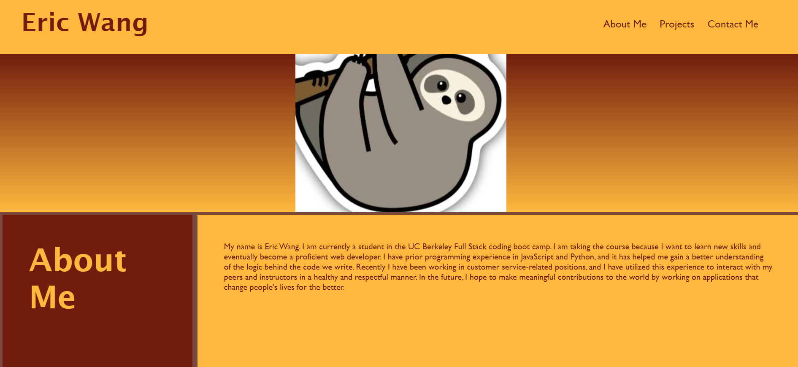

# Challenge 2 - Professional Portfolio

## Description

The purpose of this project was to create a professional portfolio that can be submitted to companies that I apply to in the future. Hiring managers can look at a comprehensive overview of the projects I have completed and the skills they required. Portfolios are important because they can give more insight into a candidate's abilities than a brief resume can. I learned how to use CSS variables to code more efficiently, use display:flex to adapt to different screen sizes effectively, and keep a webpage readable with media queries.

## Installation

No installation is required for this project.

## Usage

The following screenshots show the website's appearance:

The deployed website can be [found here](https://gimmekitties711.github.io/challenge_2_professional_portfolio/).

## Credits

#### Collaborations

Met with [Jake Krauskopf](https://github.com/JaKrau?tab=repositories) on 5-11-2023 to discuss basic webpage layout ideas.

Met with TA Michael Seaman on 5-11-2023 later in the day to troubleshoot styling issues.

#### Web Resources

The following web resources were used to help me write the code for this project:

1. [How to use HTML to open a link in a new tab](https://www.freecodecamp.org/news/how-to-use-html-to-open-link-in-new-tab/)
2. [Hex code color randomizer](https://www.random.org/colors/hex)
3. [Random number list generator](https://www.randomlists.com/random-numbers)
4. [How to use media queries (webpage)](https://www.w3schools.com/css/css_rwd_mediaqueries.asp)
5. [How to use media queries (YouTube video)](https://www.youtube.com/watch?v=yU7jJ3NbPdA)
6. [Meaning of the word "only" in media queries](https://stackoverflow.com/questions/8549529/what-is-the-difference-between-screen-and-only-screen-in-media-queries)
7. [How to use multiple backgrounds in CSS](https://www.w3schools.com/css/css3_backgrounds.asp)

## License

No license is attached to this repository.

## Features

Some of the items on the webpage link to either a specific part of the page or another webpage. The items that have an external link attached to them open the links in a new tab.
